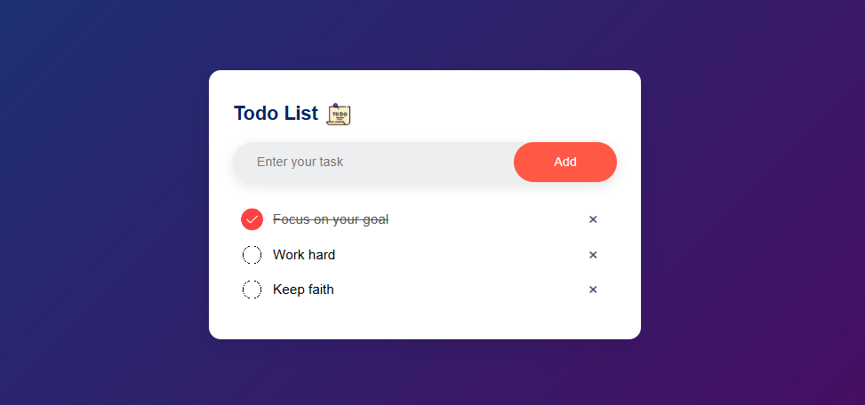

# Todo List App

  

A simple and interactive Todo List application built with HTML, CSS, and JavaScript. This app allows users to add, mark, and delete tasks, with a clean and modern user interface.

## Features

- **Add Tasks**: Easily add new tasks to the list.
- **Mark as Completed**: Click on a task to mark it as completed.
- **Delete Tasks**: Remove tasks from the list with a single click.
- **Persistent Storage**: Tasks are saved in the browser's local storage, so they persist even after refreshing the page.

## Technologies Used

- **HTML**: Structure of the application.
- **CSS**: Styling and layout.
- **JavaScript**: Logic and interactivity.
- **Local Storage**: Persistence of tasks.

## How to Use

1. Clone this repository or download the project files.
2. Open `todo.html` in your favorite web browser.
